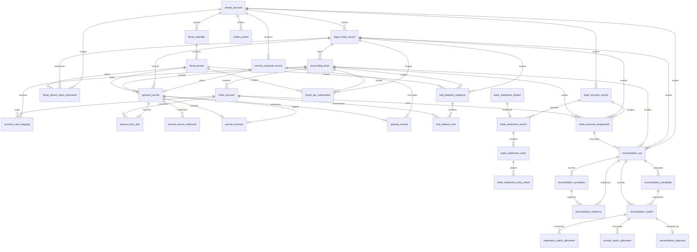

# Foundation ERD

This diagram is the code-current relational map for the posting foundation. It is a review aid for accounting, audit, security, and acquisition diligence; the PostgreSQL migrations remain the executable source of truth for columns, constraints, triggers, row-level security, and indexes.

## Integrity boundaries

`general_journal` and `journal_entry_line` are authoritative posted facts. Deferred database triggers require every committed journal to be non-empty and exactly balanced, and finalized journal populations are immutable; correction is reversal and, when needed, a separately posted replacement.

`journal_proposal_record` preserves the command-side idempotency and immutable source-payload hash that precede posting. `fiscal_period_open_command` separately preserves period-open command identity, source hash, requested dates, and the period/legal-entity foreign keys so status changes do not erase replay evidence. `journal_source_reference` preserves source lineage attached to a journal. `posting_receipt` is the authoritative source-facing outcome, and `outbox_event` is committed transactionally with the accounting state it publishes.

`home_tax_submission` is a fail-closed tax-command evidence row, not a transmitted-filing claim. Its tenant-scoped `submission_idempotency_key`, canonical `source_payload_hash`, immutable `source_payload_reference`, and derived `register_payload_hash` preserve command identity and register provenance without storing the raw VAT register or credentials.

`bank_account_record` and `bank_account_assignment` map an opaque bank account onto one legal entity, book, and same-book cash chart account. The assignment composite foreign key requires that book to belong to the same legal entity. `bank_statement_record` and `bank_statement_entry` are append-only evidence. They retain `source_artifact_hash`, `normalized_payload_hash`, `ingestion_idempotency_key`, and `source_entry_hash` so a controller can prove which original artifact produced each entry without storing the raw XML in PostgreSQL.

`reconciliation_run` binds one evaluated reconciliation to tenant, legal entity, accounting book, bank-account assignment, currency, bank/book cutoffs, matching-policy version, and knowledge cutoff. Its evaluated scope is immutable. `reconciliation_exception` and `reconciliation_evidence` retain explicit exception ownership, next action, effective/system time, evidence references, and optional hashes rather than hiding unresolved items in derived status text.

`reconciliation_candidate` records a deterministic statement/journal candidate and its exact source amounts; after INSERT it is append-only. `reconciliation_match` records the reviewable disposition. `statement_match_allocation` and `journal_match_allocation` preserve exact many-to-many consumption, including split and aggregate populations, and are append-only regardless of later match status. Database-owned conservation guards serialize by immutable source identity and reject cross-run source-amount conflicts or over-consumption. Only an `approved` match consumes active source capacity; changing that match to `rejected` or `superseded` releases active capacity without deleting or rewriting the historical candidate/allocation evidence. These reconciliation relations provide audit and operator-control evidence only: they do not post, reverse, close, approve accounting policy, or mutate authoritative journals.

`reconciliation_approval` records one immutable human decision for a proposed match. PostgreSQL computes its versioned SHA-256 snapshot from the candidate and allocation rows, serializes approval/allocation transitions with a match-level advisory lock, and rejects status-only or stale-snapshot terminal transitions. The row remains control evidence only and cannot post, reverse, close, or alter accounting policy.

## Temporal and tenant scope

Master-data mappings use validity intervals where policy or assignment can change. Fiscal-period status controls ordinary posting and the approved soft-close exceptions. Tenant-scoped composite references prevent cross-tenant joins from becoming valid accounting relationships even when UUID values are otherwise well formed.

## Runtime tenant identity

`tenant_account` is referenced by `runtime_tenant_binding`, which also records the authenticated PostgreSQL role OID/name and effective interval. This control-plane relation is not a business subledger; it supplies the trusted tenant key consumed by forced RLS for authoritative accounting tables.
