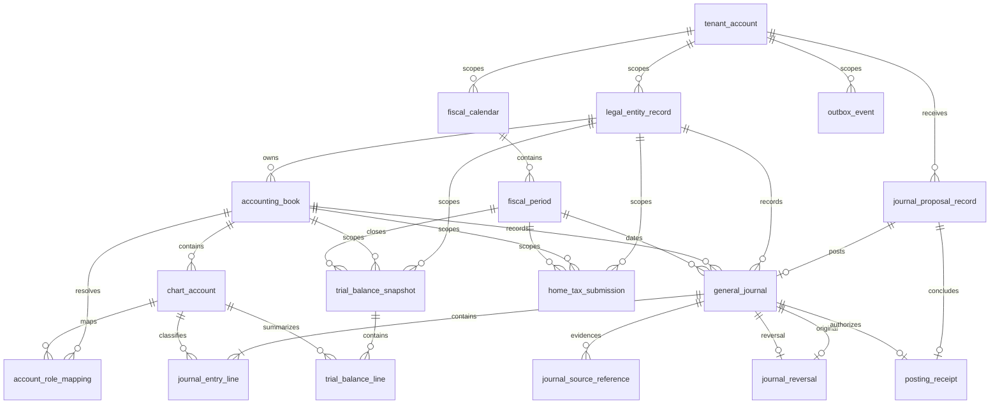

# Foundation ERD

This diagram is the code-current relational map for the posting foundation. It is a review aid for accounting, audit, security, and acquisition diligence; the PostgreSQL migrations remain the executable source of truth for columns, constraints, triggers, row-level security, and indexes.

## Integrity boundaries

`general_journal` and `journal_entry_line` are authoritative posted facts. Deferred database triggers require every committed journal to be non-empty and exactly balanced, and finalized journal populations are immutable; correction is reversal and, when needed, a separately posted replacement.

`journal_proposal_record` preserves the command-side idempotency and immutable source-payload hash that precede posting. `journal_source_reference` preserves source lineage attached to a journal. `posting_receipt` is the authoritative source-facing outcome, and `outbox_event` is committed transactionally with the accounting state it publishes.

`home_tax_submission` is a fail-closed tax-command evidence row, not a transmitted-filing claim. Its tenant-scoped `submission_idempotency_key`, canonical `source_payload_hash`, immutable `source_payload_reference`, and derived `register_payload_hash` preserve command identity and register provenance without storing the raw VAT register or credentials.

## Temporal and tenant scope

Master-data mappings use validity intervals where policy or assignment can change. Fiscal-period status controls ordinary posting and the approved soft-close exceptions. Tenant-scoped composite references prevent cross-tenant joins from becoming valid accounting relationships even when UUID values are otherwise well formed.
