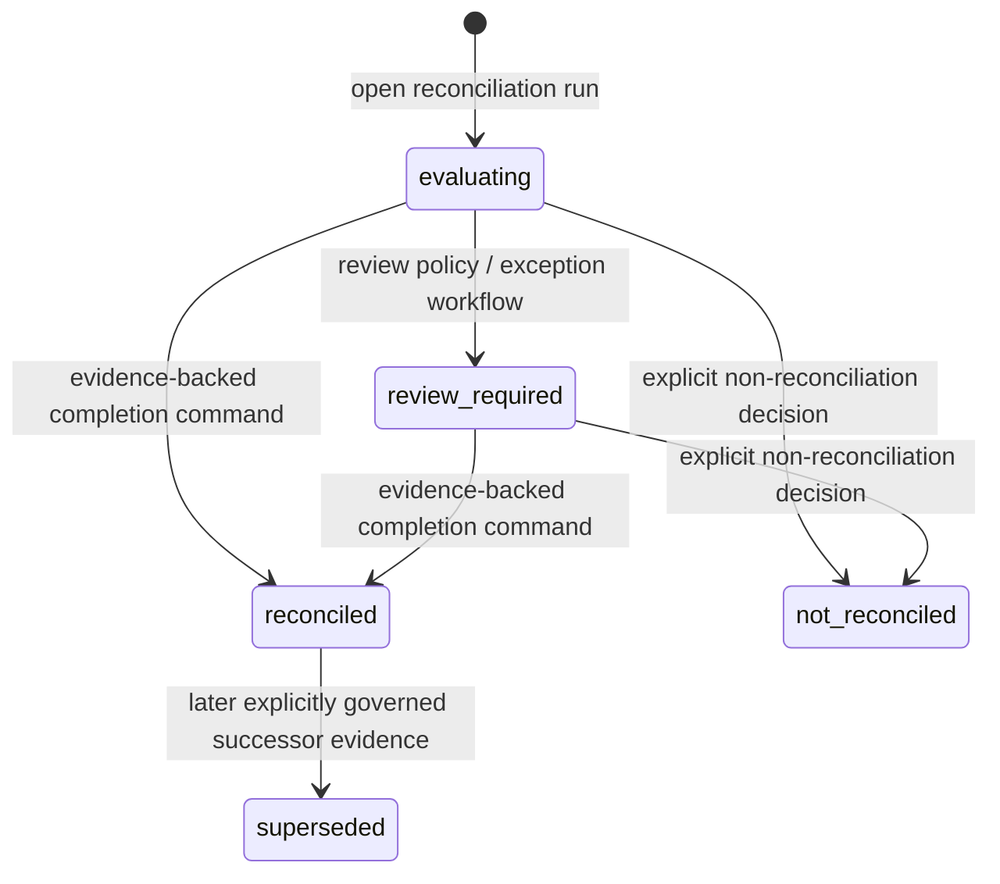

# ADR 0059: Evidence-backed reconciliation completion command

- **Status:** Proposed
- **Date:** 2026-09-01
- **Decision owner:** Accounting Record & Close bounded context
- **Depends on:** ADR 0054, ADR 0055, ADR 0056, ADR 0058 and the database-owned close-projection repair in PR #29

## Context

A reconciliation run is created as `evaluating`, while authority-bearing close-package construction correctly requires the locked run to be `reconciled`. Direct SQL status mutation is not a commercial owner-control path: it does not bind who completed the review, why they were authorized to do so, which immutable statement/book populations were evaluated, which approved match population was current, whether exceptions were resolved, or which exact book-to-bank bridge was accepted.

A generic `PATCH run_status_code` endpoint would also make an internal state representation part of the buyer contract and create an unsafe promotion primitive. The domain needs one named business command whose only authority is to complete reconciliation review from database-owned evidence. Application validation alone is insufficient for that authority boundary: the ordinary runtime must not gain reconciliation-completion power merely because it can reach the database.

## Decision

Introduce the **Reconciliation Completion** command in the Accounting Record & Close core subdomain.

The `reconciliation_run` aggregate remains the minimal transaction boundary for the lifecycle state. `reconciliation_completion_command` is immutable command/audit evidence attached to that aggregate; it is not a second mutable aggregate. Bank Statement Evidence and Reconciliation Review remain supporting contexts. Journal Posting and Fiscal Period Close remain separate authority boundaries: successful reconciliation completion cannot post/reverse a journal or close/reopen a period.

The command accepts only:

- the bound tenant reference;
- one persisted `reconciliation_run_id`;
- a tenant-scoped `reconciliation_completion_key` for idempotency;
- the accountable `actor_reference`; and
- the purpose code `reconciliation_close_review`.

The caller does **not** supply population identities, approval digests, bridge values, or a target status. In one PostgreSQL `REPEATABLE READ` transaction the owner implementation locks the run, verifies that it is `evaluating` or `review_required`, rejects open reconciliation exceptions and unreviewed `proposed` matches, reconstructs the database-owned statement/book populations and exact bridge through the same domain service used by authority-bearing close packages, reads the current approved match/approval snapshot population, and derives deterministic SHA-256 identities for that evidence.

The immutable command stores `statement_population_hash`, `book_population_hash`, `approval_population_hash`, and `bridge_evidence_hash` together with the purpose, actor, idempotency key, and complete command hash. The command is inserted before the run status changes. A database trigger rejects the first transition to `reconciled` unless the old state is `evaluating` or `review_required` and matching completion-command evidence exists in the same tenant/run transaction. The trigger independently rejects open exceptions and pending proposed matches. The same trigger rejects every other changed target status so the column-level grant needed by this command cannot be reused as a generic direct-SQL lifecycle editor; later lifecycle edges must first replace or extend the database guard as part of their own named command/evidence migration. The completion command itself is guarded by the same state/exception/pending-match preconditions, forced RLS, uniqueness, and an immutability trigger.

### Purpose-limited database authority

Migration `0020_reconciliation_completion_command.sql` creates `accounting_reconciliation_completer` as a `NOLOGIN` capability role and reasserts `NOLOGIN` on every migration. The role receives only the mutation privileges needed by this bounded command: insert/read completion-command evidence, update `reconciliation_run.run_status_code`, and append the transactional outbox event. Deployment must grant membership to a separately authenticated, tenant-bound runtime identity used for reconciliation completion; ordinary posting/read runtimes do not inherit it automatically.

Both command insertion and a first transition to `reconciled` evaluate `pg_has_role(session_user, 'accounting_reconciliation_completer', 'MEMBER')`. A caller-controlled GUC or application `SET ROLE` is not authority, and the migration never performs `SET ROLE accounting_reconciliation_completer`. The status trigger additionally rejects any changed target other than `reconciled`, so possession of the narrow column privilege is not sufficient to manufacture `review_required`, `not_reconciled`, or `superseded` state. This follows the existing soft-close capability pattern while keeping reconciliation completion distinct from `accounting_closing_writer`: reconciliation completion does not grant journal or fiscal-period close powers.

The same transaction appends an `accounting_integration.outbox_event` with event type `reconciliation_run.reconciled`. An exact retry of the same idempotency key replays the immutable command without reinterpreting later mutable state; a changed command under the same key fails with `IdempotencyConflictError`, and the unique tenant/run command prevents a second key from replacing the completion that already reconciled the run.

## State-machine boundary

This ADR governs only the two arrows into `reconciled`. It does not invent policy for the other arrows; those require their own owner commands/evidence before becoming public mutation APIs. Until those commands exist, migration `0020` deliberately fails closed on every changed `run_status_code` target other than `reconciled`, including for a session that holds `accounting_reconciliation_completer` membership.

## Invariants

1. A first transition to `reconciled` has exactly one immutable tenant/run completion command.
2. The command cannot be inserted for a run outside `evaluating` or `review_required`.
3. Open exceptions and `proposed` matches block both command insertion and the DB status transition.
4. Statement/book population identity, approved population identity, and exact bridge evidence are database-derived in one consistent snapshot; no caller value can substitute them.
5. The book-to-bank bridge must have zero unexplained difference under exact Decimal arithmetic before the completion command can be recorded.
6. Exact idempotent retry replays immutable evidence. Changed command identity under the same key fails closed.
7. Completion, status transition, and transactional-outbox evidence commit atomically.
8. The authenticated PostgreSQL `session_user` must be a member of `accounting_reconciliation_completer` for command insertion and transition; ordinary runtime or caller-controlled session state is insufficient.
9. `accounting_reconciliation_completer` is `NOLOGIN` and is separate from `accounting_closing_writer`; neither capability implies the other.
10. The completion capability may change `run_status_code` only to `reconciled`; all other changed targets fail closed until a separately governed lifecycle command and database guard exist.
11. Reconciliation completion does not grant journal posting, reversal, fiscal-period close, tax filing, or accounting-policy authority.
12. `actor_reference` and `completion_purpose_code` are retained as audit facts. A later purpose-bound Keyverse/PDP integration may strengthen admission, but must not reinterpret or overwrite this evidence.

## API layering

The Python domain API is `accept_reconciliation_completion`. The buyer-facing stdlib HTTP transport is deliberately implemented as a stacked successor so the database/domain authority change and transport routing have independently reviewable diffs. The HTTP contract will expose `POST /reconciliation-completions`; it must not expose a generic run-status mutation endpoint.

The production connection used by that route must be both tenant-bound through `runtime_tenant_binding` and explicitly granted `accounting_reconciliation_completer`. Deployment grant/revoke is an owner-control operation and must be retained as operational evidence. The application does not grant itself this role.

## Consequences

The product gains a lawful path from normal API-created runs to the state required by close-package construction. Controllers can distinguish “review completed from authoritative evidence” from an internal status write, and downstream audit/event consumers receive an atomic transition event. The cost is an additional durable command table, a purpose-specific database capability, and one evidence-hashing read path, accepted because correctness, least privilege, and auditability dominate latency for this control action.

The narrow column privilege is paired with a fail-closed trigger rather than treated as general lifecycle authority. A later `review_required`, `not_reconciled`, or `superseded` command therefore has to carry its own evidence model and deliberately evolve the database state machine instead of silently reusing this role.

## Research and standards traceability

- PostgreSQL Global Development Group. (2026). *PostgreSQL 18 documentation: Transaction isolation*. https://www.postgresql.org/docs/18/transaction-iso.html
- Cai, Z., Liu, S., Wei, H., Chen, Y., & Pan, A. (2025). Fast verification of strong database isolation (Extended Version). *Proceedings of the VLDB Endowment, 19*, 563–575. https://consensus.app/papers/fast-verification-of-strong-database-isolation-extended-cai-liu/e7131ce449515d41ab6104cc32c3e2b7/
- Logrippo, L. (2025). Data flow security in role-based access control. *Journal of Information Security and Applications*. https://consensus.app/papers/data-flow-security-in-rolebased-access-control-logrippo/95874bd5d780530a8e80eece583cda0e/?utm_source=chatgpt
- World Wide Web Consortium. (2013). *PROV-O: The PROV ontology*. https://www.w3.org/TR/prov-o/

The PostgreSQL and VLDB sources support making isolation semantics an explicit, verifiable integrity contract. Logrippo (2025) formalizes integrity reasoning over RBAC role/permission assignments and reconfiguration, supporting the decision not to treat a narrow status-column privilege as unconstrained lifecycle authority. PROV-O supports retaining provenance as separately identifiable evidence. None of these sources grants accounting authority or substitutes for the repository's exact PostgreSQL integration tests.
