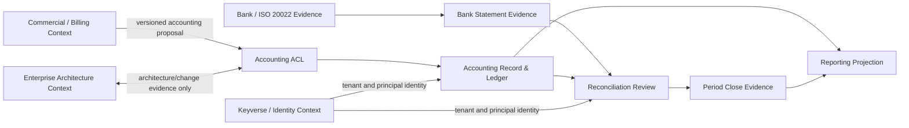

# Product and technical gap baseline

**Evidence refresh:** 2026-09-01 (Asia/Seoul)

This file is the durable buyer-visible gap queue for `accounting-information-platform`.
It records product authority, dependency order, architectural boundaries, acceptance
evidence, and gaps that remain meaningful after an individual commit or workflow run
changes. **Live PR/check evidence is intentionally not duplicated here**: refetch every
open pull request, issue, the live `develop`/`main` branch state, formal reviews, review
threads, rulesets, and exact-head workflow jobs before making any merge, release, or
readiness decision. A remembered head, queued workflow, predecessor review, generated
repair commit, or status-only signal is never a substitute for that fresh evidence.

## Durable product boundary

`accounting-information-platform` is the accounting system of record downstream of
commercial and operational systems. It owns legal entities, accounting books, chart
accounts and mappings, fiscal periods, authoritative balanced journals, reversal
lineage, close, trial balance, statutory/management projections, posting receipts,
accounting transactional-outbox evidence, and accepted immutable bank-statement
evidence with normalized entries and exact numeric balance facts.

Metering/billing remains authoritative for usage, pricing, invoice intent, payment,
refund, dispute, provider-settlement, and other commercial evidence. It may publish
versioned accounting proposals through an agreed contract, but it may not write
accounting tables directly, select final chart-account identifiers, or claim that a
proposal is a statutory posting.

The current foundation is backend-first: Python domain/reference logic, PostgreSQL
persistence and database-owned invariants, a bounded stdlib HTTP surface, versioned
JSON contracts, and a durable outbox. Mathematical/statistical/data-science core
computation is not owned by this accounting bounded context; if such computation is
introduced, the ecosystem Rust-core rule applies at the owning boundary rather than
silently embedding a Python numerical engine here.

The accounting posting foundation and immutable `camt.053.001.14` bank-statement
evidence registry are protected-`develop` facts. The current reconciliation integration
candidate contains database-owned candidate/match/allocation conservation, durable
human approval snapshots, run command provenance, database-owned close-population
hardening, and exact bridge reconstruction, but it is **not** release authority until
integrated on protected `develop` after one unchanged head satisfies every applicable
gate. A stacked lifecycle candidate now adds the supported `reconciled` transition,
exact replay of persisted statement/book population provenance, and immutable
evidence-to-run aggregate membership on top of that dependency root; it likewise is not
integration evidence until its own exact-head proof passes and it is incorporated into
the parent before protected-branch integration. The product does not transmit
HomeTax/NTS filings, enforce purpose-bound application authorization on every route, or
provide a controller UI. Those omissions are explicit product scope, not implied
successes.

## Current DDD and context-map baseline

Core subdomain: **Accounting Record & Close**. Supporting subdomains include **Bank
Statement Evidence**, **Reconciliation Review**, **Reporting Projection**, and
**Accounting Operations**. Identity is supplied by the ecosystem IdP boundary; billing,
enterprise-architecture, retrieval, and orchestration products are foreign contexts and
must enter through versioned APIs/events or anti-corruption layers. Shared kernels stay
minimal and contain contracts rather than mutable implementation.



Minimum aggregate boundaries remain small: journal/posting, reconciliation run/review,
period close, and statement acceptance do not become one transaction aggregate. Bank
statement facts never gain posting authority. A reconciliation package is evidence for
an authorized close decision; it is not itself a journal, approval principal, or period
state transition. The lifecycle command belongs to the reconciliation-run aggregate and
remains separate from the period-close aggregate. Candidate, match, allocation,
approval, and exception evidence may not be re-parented between tenant/run aggregate
roots; corrections are append/supersede operations in a new run rather than historical
foreign-key reassignment.

## Open work inventory

| Item | Durable role | Current state | State expectation before it can close |
| --- | --- | --- | --- |
| Accounting posting foundation | Dependency root for every later slice | Integrated | Post-integration signed provenance/SBOM attestations remain green on the integrated head before any release claim |
| Immutable bank-statement evidence registry | First buyer-visible reconciliation input | Integrated | Exact replay, changed-hash conflict, parser fail-closed behavior, tenant isolation, canonical timestamp handling, and assignment command identity remain protected-branch invariants |
| Deterministic reconciliation and exact book-to-bank bridge | Deterministic evidence interpretation | Integrated foundation plus current hardening candidate | Exact Decimal equations, explicit abstention, stable-source conservation, and no automatic posting remain invariant |
| Durable reconciliation review evidence | Candidate/match/allocation + approval snapshot + run command provenance | Present in current integration candidate | Current-head PostgreSQL tests prove RLS, graph connectivity, conservation, snapshot binding, lock order, source provenance, and immutable reviewed evidence |
| Database-owned close projection | Authority-bearing statement/book populations and monetary bridge | **Source-addressed on dependency root; exact-head proof pending** | Current exact-head evidence must prove statement balances/entries, assigned-book cash journals, approved allocations, population digests, bridge components, `REPEATABLE READ`, and caller-substitution rejection from PostgreSQL facts |
| Reconciliation lifecycle command | Lawful transition from `evaluating`/`review_required` to `reconciled` | **Stacked implementation candidate; exact-head proof pending** | Tenant-scoped idempotency, actor/purpose evidence, exact source/review snapshot binding, persisted population provenance on replay, DB-enforced legal edge, direct-SQL rejection, immutable evidence aggregate membership, post-reconcile evidence freeze, atomic outbox, concurrency proof, and later purpose-bound HTTP integration |
| Historical timing-difference evidence | Carry-forward/outstanding treatment across periods | Open after current-period authority | Durable, policy-traceable representation; never fabricate an opening difference from caller-shaped projection data |
| Purpose-bound accounting authorization | Least-privilege operation authority | Open | Versioned permission model with fail-closed decisions and immutable allow/deny evidence; lifecycle HTTP exposure must use this boundary rather than create an unauthenticated high-impact route |
| Controller close/reconciliation UX | Buyer-facing workflow | Open | Figma source of truth, design tokens, Storybook scene/edge inventory, accessibility/i18n, screenshot review, and API-backed actions only after the accounting authority path is stable |
| Branch/release governance | Integration and release control plane | In progress across repository and central `.github` | Protected `develop`/`main`, exact-head required checks, independent review, no force-push/deletion/bypass path, reliable central reviewer execution, and post-merge attestations |

Issue and PR numbering belongs to live tracker state; this table records durable roles so
renumbering or restacking cannot silently drop a commitment.

## Current dependency-root order

1. **Preserve protected accounting foundations.** Posting and immutable statement
   acceptance stay stronger than application intent and remain the base for every
   successor.
2. **Prove database-owned close projection authority on the dependency root.** The
   production implementation is now source-addressed directly on the active dependency
   root: one `REPEATABLE READ` transaction reconstructs statement facts, book-scoped
   cash journals, current allocations, deterministic population identities, and the
   exact bridge from PostgreSQL. This state remains provisional until one unchanged
   parent head passes the real PostgreSQL, coverage, repository, security, supply-chain,
   and review evidence; queued or predecessor checks do not transfer.
3. **Prove and integrate the evidence-backed `reconciled` transition.** A stacked child
   now implements a public lifecycle command that accepts only `evaluating` or
   `review_required`, derives eligibility from the database-owned bridge plus complete
   review/exception populations, persists actor/purpose/idempotency/snapshot and exact
   statement/book population evidence, rejects raw SQL reconciliation status authority,
   rejects tenant/run re-parenting of lifecycle-protected evidence, freezes reviewed
   evidence after reconciliation, replays the stored provenance rather than rebuilding
   from later state, and publishes the transactional outbox event atomically. Because it
   extends the still-unreleased migration `0019`, this child must merge into the parent
   before that parent integrates into protected `develop`; if the parent lands first,
   the lifecycle schema must become a forward migration instead of rewriting `0019`.
4. **Revalidate the combined dependency root.** After the child is incorporated, one
   unchanged normalized parent head must reacquire real PostgreSQL behavior, 100% owned
   statement/branch and edge-case coverage, repository/public-docstring contracts,
   SAST/security/dependency review, reproducible package/SBOM/provenance, current-head
   reviews, protection rules, and integrated-head evidence. Child or predecessor checks
   do not transfer across the changed parent head.
5. **Restack downstream reconciliation/verification work.** Rebuild successors from the
   integrated protected head; do not transfer predecessor checks or consume mutable
   open-PR implementation bytes across repositories.
6. **Build buyer workflow and authorization.** Purpose-bound authority precedes a
   production controller HTTP lifecycle route and UI. The UI then exposes accounting
   outcomes and next actions, not internal service or repository boundaries.

Central reviewer reliability is a causal ecosystem dependency, not a reason to weaken
accounting gates. The Strix model-preflight zero-timeout defect has been repaired in the
central `.github` owner; runner/reviewer queue waits remain non-blocking and work moves
to another safe lane while evidence is pending.

## Buyer-visible gaps and exit evidence

| Priority | Gap | Buyer impact | Required evidence before closing |
| --- | --- | --- | --- |
| P0 | Database-owned close projection is source-addressed but not yet proven on one unchanged integration head | Controllers must know a close package cannot wrap a genuine run around invented population references, digests, or balanced amounts | Exact-head real PostgreSQL regressions proving database-derived statement/book population identity, exact opening/movement/closing balances, source-capacity-bounded allocation consumption, exact bridge equality, `REPEATABLE READ`, assigned-book scoping, and caller substitution rejection |
| P0 | Supported `reconciled` transition now exists only as a stacked implementation candidate | Controllers still lack protected-branch lifecycle authority until the candidate is proven and integrated; direct SQL must remain invalid | Exact-head unit/PostgreSQL proof for idempotent tenant command, immutable actor/purpose/snapshot evidence, DB-enforced state edge, approved-match completeness, unresolved-exception rejection, exact population/bridge binding, stable stored population provenance on replay, lifecycle-lock concurrency, cross-run evidence re-parent rejection, post-reconcile evidence freeze, atomic outbox, complete coverage, and parent-head revalidation after stacking |
| P0 | Repository governance must enforce intended merge/release policy | A technically green candidate could otherwise integrate without durable control-plane enforcement | Protected `develop`/`main`, required accounting CI/security/dependency gates, independent review, resolved current-head findings, no force-push/deletion path, and effective ruleset evidence |
| P0 | Database authority must remain stronger than application intent | Direct SQL must never rewrite balances, tenant scope, finalized facts, reviewed evidence, or closed periods | PostgreSQL runtime tests for deferred balance, append-only/finalization guards, forced RLS with restricted runtime login, DB-owned tenant binding, lifecycle/status guard, lock order, temporal reversal rules, and purpose-limited close authority |
| P1 | Historical outstanding/timing differences lack a durable carry-forward model | Reconciliation may explain the current period but cannot safely invent prior-period opening differences | Policy-backed persisted evidence and exact lineage across run cutoffs, with fail-closed handling when immutable history is insufficient |
| P1 | Purpose-bound authorization is absent | Tenant authentication alone is too coarse for posting, reversal, approval, reconciliation, close, tax, and audit powers | Versioned operation-to-permission mapping, host identity adapter boundary, fail-closed authorization tests, immutable allow/deny evidence, no caller/model-controlled promotion, and purpose-bound lifecycle HTTP route |
| P1 | Production operability and release proof remain incomplete | An operator cannot yet deploy, observe, back up, recover, and release with diligence-grade evidence | Supported compose/Podman/Colima boundary, migration/rollback rehearsal, outbox-drain ownership, metrics/alerts, backup/restore exercise, integrated-head signed attestations, release version, artifact/source hashes, and recovery runbook |
| P2 | No controller frontend/design-system surface exists | Controllers have no visual close/reconciliation workflow | Figma File ID recorded in ADR, reusable design tokens, Storybook scene/edge events, exact-value tables/exports, i18n consistency, accessibility/touch/responsive tests, browser screenshots, and k6-backed asynchronous APIs |

## Evidence model for integration

Each integration candidate is expected to prove the following together on one unchanged
head before it is accepted. Numbers, digests, run identifiers, and commit hashes stay in
live PR/issue evidence rather than being copied into this durable baseline.

- real PostgreSQL integration on the pinned supported major/minor image;
- exact 100% statement and branch coverage for owned production/validator code plus
  explicit edge-case denominator evidence;
- complete public production API docstrings and deterministic repository contracts;
- database-owned balance, finalization/append-only, tenant-isolation, reconciliation,
  lifecycle, close, temporal, and command-idempotency invariants;
- exact-head SAST, vulnerability/secret/misconfiguration scanning, dependency diff and
  vulnerability evidence bound to an independently resolved live base;
- reproducible package build, install smoke, deterministic checksums, SPDX SBOM, and
  source-provenance evidence bound to the same exact head;
- no self-mutating repair/normalization/source-fix workflow in the publishable tree;
- all still-valid review findings resolved and qualifying independent approvals;
- after lawful integration, signed integrated-head provenance/SBOM attestations before
  any version/tag/release claim.

An aggregate workflow conclusion is not enough if a required step is skipped or the
workflow checked out a synthetic merge ref. Likewise, a local test, model review,
status context, predecessor head, generated successor commit, or old artifact may
inform diagnosis but cannot satisfy the exact-head release gate.

## Accounting invariants that remain non-negotiable

- Monetary and quantity values that affect journals, balances, reports, or
  reconciliation use exact decimal arithmetic; no binary floating-point accounting.
- A durable journal is non-empty and exactly debit/credit balanced at the database
  commit boundary.
- Finalized journal facts and source/reversal/receipt evidence are append-only;
  corrections use explicit reversal and reposting.
- Ordinary posting cannot bypass a closed period; limited soft-close exceptions require
  database-owned authorization as well as matching transaction intent.
- Runtime tenant isolation is derived from database-controlled runtime identity, not a
  caller-writable session setting or request-body field.
- Commands use tenant-scoped idempotency identity plus immutable source evidence; a
  changed command under the same key fails closed.
- Command outcome and accounting transactional-outbox evidence commit atomically.
- A reconciliation run can become `reconciled` only through one immutable lifecycle
  command whose exact source/review snapshot ties; reviewed evidence is frozen after
  reconciliation, tenant/run aggregate membership is immutable, exact population
  provenance replays from durable command evidence, and corrections require a
  new/superseding run.
- Authoritative relational data stays in 3NF unless a documented bounded read model
  justifies otherwise; hot partitions, lock order, read/write separation, and every
  item-level UPSERT/ownership contract are explicit.
- Database object names use descriptive two-or-more-word `snake_case` by preference;
  contextually required camelCase/PascalCase is acceptable, but ambiguous one-word
  identifiers are not introduced as durable object names.
- LLM/model output is untrusted interpretation or proposal only. It cannot post a
  journal, approve reconciliation, choose a chart account, consume a monetary amount,
  alter accounting policy, or manufacture accounting evidence.
- A bank-statement entry never posts, reverses, approves, or mutates a journal by itself;
  unmatched evidence becomes an exception or an explicit adjusting-journal proposal
  reviewed under authority.

## Bank-reconciliation target

```text
immutable bank statement artifact
→ normalized statement / entry / balance identity     [integrated]
→ bank-account ↔ legal-entity / accounting-book scope [integrated]
→ deterministic candidate matching                    [integrated]
→ exact book-to-bank bridge                            [foundation integrated]
→ durable run / exception / command evidence           [current integration candidate]
→ candidate/match allocation conservation              [current integration candidate]
→ immutable approval snapshot                          [current integration candidate]
→ DB-owned statement/book populations + bridge         [source-addressed; proof pending]
→ evidence-backed reconciled transition                [stacked implementation; proof pending]
→ authority-bearing close package                      [blocked until combined head is green]
→ purpose-bound controller HTTP/API workflow           [next buyer-facing authority slice]
→ controller close/reconciliation UI                   [later buyer-facing slice]
```

The statement adapter pins the supported ISO 20022 message-definition revision and
vendored validation evidence; runtime parsing performs no external schema/entity fetch
and fails closed on revision drift, entity expansion, unbounded depth, or non-canonical
decimals. Matching precedence starts with stable provider/end-to-end identities, then
exact amount/currency plus bounded date policy, then approved composite rules, and
otherwise abstains. LLM assistance may summarize or prioritize exceptions but never
consumes monetary evidence or approves/posts a result.

## Web, operability, and UX acceptance once those surfaces exist

Any HTTP path used by the production buyer workflow must be asynchronous where blocking
work would otherwise make the service unresponsive. k6 end-to-end load tests cover all
buyer pages/critical API actions with a p95 target of 20 ms per page/action; exceeding
the gate requires bottleneck removal rather than threshold relaxation. Connection
cleanup tests must not assume `close_connection` exists only as an instance attribute.
Container guidance records compose-first operation, Podman/Colima alternatives,
hardware-aware PostgreSQL/shared-memory tuning, and any relevant CPU/GPU/native-module
boundary. Temporary isolation containers are removed after verification.

When a frontend is introduced, customer copy names accounting outcomes and the next
action rather than repositories, services, or agent internals. Repeated UI objects use
design tokens and reusable components. Figma, Storybook, accessibility, touch and
interaction, responsive layout, typography/color, forms/feedback, navigation, charts,
i18n, and screenshot review become required evidence rather than documentation-only
intent.

## Release and diligence rule

Do not create a release, version, or tag from a PR candidate. Release evidence must come
from one exact integrated protected head after migration and rollback rehearsal,
backup/restore and operational acceptance, current security/dependency gates,
reproducible package/SBOM/provenance evidence, qualifying review, and any applicable
accessibility acceptance all pass together. `CHANGELOG.md` and artifact/source hashes
must describe that exact integrated release fact. Mention GitHub Pages as a product
surface only after it is actually published and verified.

## Authority and standards traceability

The durable product, technical, security, data, operating, decision, and standards
records remain authoritative in `README.md`, `AGENTS.md`, `CLAUDE.md`, `docs/PRD.md`,
`docs/TRD.md`, `docs/ARCHITECTURE.md`, `docs/DATA_MODEL.md`, `docs/ERD.md`,
`docs/SECURITY.md`, `docs/TEST_STRATEGY.md`, `docs/OPERABILITY.md`, `docs/adr/`, and
`docs/doctoring/`. Current international/accounting technical decisions belong in the
APA 7 bibliography and standards traceability records, including ISO 20022 evidence
backing the statement adapter and PostgreSQL 18 concurrency/row-trigger semantics
backing ADRs 0060 and 0061. CSAP/SOC 2 are design and diligence targets, not
certification claims. Real-person and institution data used for development/testing
must be anonymized, while production PII protection must preserve lawful accounting
work rather than relying on masking that destroys required business meaning.