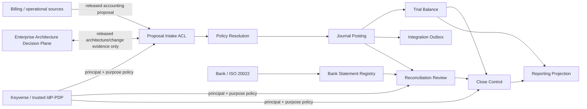
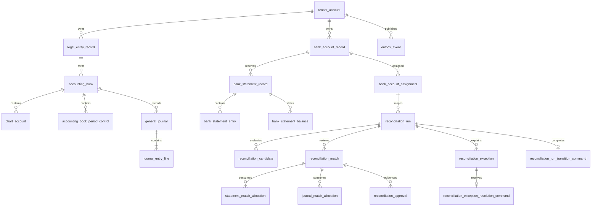
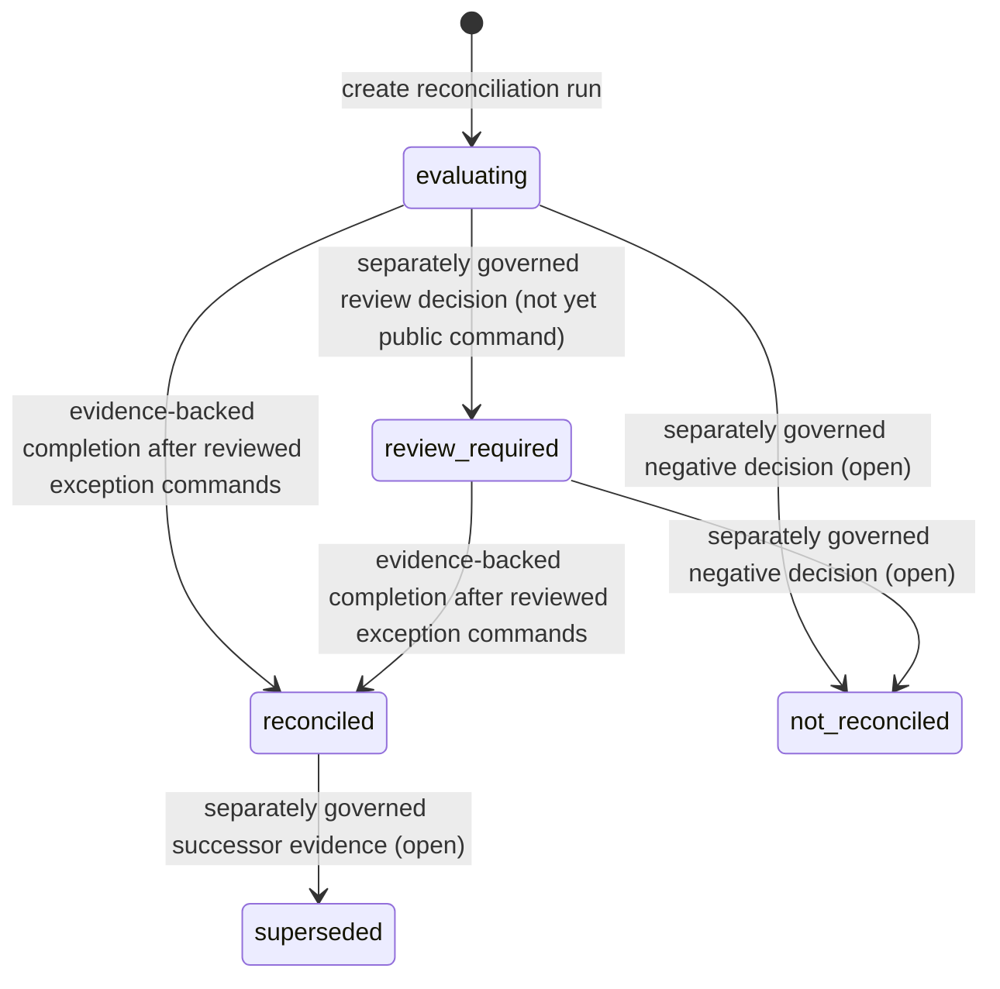

# Product and technical gap baseline

**Evidence refresh:** 2026-09-02 (Asia/Seoul)

This is the durable commercialization baseline for `ContextualWisdomLab/accounting-information-platform`. It records product responsibility, DDD boundaries, buyer outcomes, technical contracts, architecture/data/test/security/operability evidence, and the remaining gaps that survive individual branch or workflow changes. **Live PR/check evidence is intentionally not duplicated here**: live PR numbers, exact heads, check conclusions, rulesets, reviews, and release state must be refetched before every integration, release, or readiness decision.

## Product responsibility and buyer outcome

`accounting-information-platform` is the accounting system of record downstream of commercial and operational systems. Controllers, accounting operations, finance-platform engineers, and auditors must be able to receive source evidence, apply accounting policy, post balanced immutable journals, reverse without destroying history, reconcile independent bank evidence, close accounting books, produce exact reporting projections, and prove each accounting result back to immutable source evidence.

The platform owns legal entities, accounting books, chart accounts and effective mappings, fiscal periods, authoritative balanced journals, reversal lineage, trial balance, close evidence, reporting projections, posting receipts, accounting transactional-outbox evidence, immutable bank-statement evidence, reconciliation review evidence, and the accounting-side lifecycle of a reconciliation run. Metering/billing remains authoritative for usage, pricing, invoice intent, payment, refund, dispute, settlement, and other commercial truth. Identity/policy providers remain authoritative for authenticated principal and policy decisions. Foreign products may propose evidence through released versioned contracts; they may not write accounting tables, select final statutory chart accounts, post journals, approve reconciliation, or close periods.

The repository is backend-first. No controller frontend is currently a release claim. Mathematical/statistical/data-science computation is not a responsibility of this accounting bounded context; if introduced, the ecosystem Rust-core rule applies at the owning boundary rather than embedding an ad-hoc Python numerical engine here.

## Current commercial capability map

| Capability | Durable state | Buyer-visible exit evidence |
| --- | --- | --- |
| Proposal → balanced journal → posting receipt | Integrated foundation | Exact replay vs conflicting idempotency, database-balanced non-empty journals, immutable source evidence, transactional receipt/outbox, tenant/book/period policy |
| Append-only reversal | Integrated foundation | Equal-and-opposite lineage, no mutation/deletion of original journal, temporal and closed-period controls, idempotent replay |
| Trial balance and reporting projections | Integrated foundation | Exact Decimal aggregation from authoritative populations; projections never become alternate write authority |
| Fiscal-period soft/hard close | Integrated foundation | Book-scoped close authority, immutable close evidence/snapshot, database guard against later ordinary writes |
| Immutable ISO 20022 bank evidence | Integrated foundation | `camt.053.001.14` revision pin, parser fail-closed behavior, immutable artifact/source hash, normalized entries/balances, bank-account assignment scope |
| Deterministic bank reconciliation | Integrated foundation plus current hardening stack | Stable-reference precedence, exact amount/currency/direction, explicit abstention, split/aggregate conservation, immutable review evidence, exact book-to-bank bridge |
| Database-owned close projection | Current dependency-root integration candidate | Run/approval/exception/statement/book/allocation populations loaded from one `REPEATABLE READ` snapshot; caller population or money substitution rejected; assigned cash journals proven book-scoped |
| Evidence-backed reconciliation completion | Current stacked candidate, not protected-branch authority | Named idempotent command; database-derived populations/bridge/approvals; immutable transition command and outbox evidence; post-commit exactly one matching outbox event remains bound while `published_at` may advance; only `evaluating`/`review_required` → `reconciled`; deployment capability-role hardening remains open |
| Immutable reconciliation exception resolution | Current stacked candidate, not protected-branch authority | Named maker-checker command; complete incoming-command payload identity kept separately from reviewed evidence; exception maker evidence frozen; terminal status and outbox atomic; post-commit exactly one matching outbox event remains bound despite duplicate/re-key attempts while `published_at` may advance; exact replay/conflict semantics; legacy terminal history fails migration closed even for a non-`BYPASSRLS` migration owner |
| Purpose-bound application authorization | Open | Versioned operation→permission contract, trusted identity adapter, durable allow/deny evidence, no tenant-auth-only high-impact authority |
| Production controller reconciliation/close UX | Open | Figma source of truth, design tokens, Storybook scene/edge inventory, accessibility/i18n, exact-value tables/exports, screenshot verification, API actions bound to authorization |
| Release/operations diligence | Open | Protected integration/release branches, exact-head checks/reviews, migration rehearsal, rollback/recovery evidence, observability, reproducible package/SBOM/provenance, immutable release evidence |

## PRD delta and product goals

The repository PRD's foundation goal remains valid but is no longer sufficient for commercialization. The current buyer goal is:

> A controller can move from source accounting evidence through reviewed reconciliation and close without spreadsheets or direct SQL, while an auditor can reconstruct every monetary and authority decision from immutable evidence and an operator can deploy/recover the system with release-grade proof.

Commercial acceptance therefore requires all of the following together:

1. no unsupported direct-SQL status or accounting-authority shortcut;
2. every state-changing external command has tenant-scoped idempotency plus immutable source evidence;
3. close/reconciliation evidence is derived from database-owned facts in one consistent snapshot;
4. operation authority is purpose-bound and distinct from tenant authentication;
5. every buyer-visible workflow states the next action and hides repository/service internals;
6. deployment, migration, recovery, observability, supply-chain, and exact integrated-head evidence are first-class product capabilities rather than release-day manual procedures.

## TRD delta and technical goals

The product remains a contract-first modular monolith until measured responsibility boundaries justify extraction. PostgreSQL 18 is the durable authority. Application/domain logic is isolated from transport and persistence adapters. Each multithreaded HTTP request owns an independent transaction. State-changing commands use bounded lock/idle-transaction timeouts and deterministic lock ordering. Exact monetary values use canonical decimal strings at contracts and PostgreSQL `numeric(38,6)`/`Decimal` internally; binary floating point is forbidden for accounting money.

New technical requirements added by the reconciliation/close vertical:

- authority-bearing reads use one explicit `REPEATABLE READ` transaction when multiple rows/populations must describe one historical accounting fact;
- `reconciliation_run` lifecycle changes and `reconciliation_exception` terminal decisions are named commands, not generic status mutation;
- exception-resolution idempotency binds the complete incoming JSON command separately from the reviewed-evidence digest, and maker evidence is immutable before checker review;
- all-tenant migration preflights over FORCE-RLS accounting history must have explicit transaction-scoped migration-only visibility and remove it before durable authority changes; a tenant-filtered empty result is not upgrade evidence;
- database capability roles are NOLOGIN and narrower than business authority; trigger invariants constrain the effective operation set even when a column privilege is required;
- database-owned tenant binding and forced RLS remain stronger than caller headers/GUCs;
- no open-PR bytes from another repository become a production runtime dependency; only immutable released/versioned contracts cross repositories;
- no direct cross-service SQL or foreign application implementation imports;
- every external mutation must atomically record its authoritative result/evidence and transactional outbox fact where publication is part of the contract;
- reconciliation completion and exception-resolution authority must retain exactly one matching outbox event post-commit: deleting or re-keying the bound identity, inserting a duplicate exact event, or re-keying an unrelated event into the same identity fails closed, while `published_at` remains publication metadata rather than accounting authority.

## DDD baseline

### Subdomains

| Subdomain | Classification | Responsibility |
| --- | --- | --- |
| Authoritative Accounting Record & Close | Core | policy resolution, journal posting/reversal, fiscal-period state, trial balance, close authority and accounting receipts |
| Bank Statement Evidence | Supporting | provider/ISO 20022 ACL, immutable statement/entry/balance evidence and bank-account assignment |
| Reconciliation Review | Supporting | run scope, deterministic candidates, allocations, approvals/exceptions, exception-resolution authority, exact bridge, completion evidence, close-review package |
| Reporting Projection | Supporting | ledgers, balances, statements, packages and exact read models |
| Tax Evidence Interface | Supporting | VAT/HomeTax evidence/receipts only within implemented scope |
| Integration/Transport | Generic | HTTP/serialization/persistence mechanics and transactional outbox delivery evidence |

### Bounded-context map



### Ubiquitous-language invariants

- **proposal ≠ journal**: a source event proposes accounting treatment; only AIS produces authoritative posted journal facts.
- **statement entry ≠ journal line**: bank evidence is independent observed evidence and never posts automatically.
- **exception terminal status ≠ reviewed resolution authority**: `resolved`/`superseded` is authoritative only when paired atomically with the immutable maker-checker resolution command and retained evidence, and exactly one matching outbox event remains bound after commit.
- **reconciliation approval ≠ period-close authority**: reconciliation completion proves reviewed evidence; close remains a separate command/authority boundary.
- **tenant identity ≠ operation authority**: correct tenant binding does not imply permission to post, reverse, approve, close, publish, or submit tax evidence.
- **capability role ≠ generic lifecycle editor**: a database role exists to implement a named command and may be further constrained by triggers/invariants.
- **projection ≠ source of truth**: reports/EA/context projections cannot mutate the accounting record.

### Aggregate and invariant ownership

| Aggregate | Smallest transaction boundary | Required invariant |
| --- | --- | --- |
| Proposal admission/posting | one proposal command | one idempotency identity binds one immutable payload; journal is non-empty/balanced; receipt/outbox atomic |
| Reversal | one reversal command | original remains immutable; reversal is equal-and-opposite and temporally lawful |
| Book-period control | one book-period command | ordinary posting cannot cross protected close state; exceptional authority is explicit |
| Bank statement acceptance | one statement ingestion command | duplicate delivery replays exact evidence; revision/scope/hash conflicts fail closed |
| Reconciliation run | one run/lifecycle command | scope/cutoffs immutable after evaluation; transitions require owner evidence |
| Reconciliation review | one match/approval decision | allocations conserve source capacity; terminal decisions bind immutable snapshots |
| Reconciliation exception resolution | one maker-checker resolution command | owner/maker evidence is immutable; reviewer differs from owner; one command binds complete source payload + reviewed evidence; terminal status/outbox commit atomically and exactly one matching outbox event survives post-commit |
| Reconciliation completion | one completion command | exact database-derived populations/bridge + current approval/exception state; only lawful transition to `reconciled`; exactly one matching outbox event remains bound post-commit |
| Outbox record | one originating domain transaction | event evidence cannot exist without committed owning fact; reconciliation authority identity cannot later be detached or duplicated while `published_at` may advance independently |

## Core ERD baseline

Authoritative tables remain normalized relational facts. The reconciliation/close slice adds to the foundation rather than storing an opaque reconciliation JSON aggregate.



Database object rules remain mandatory: descriptive two-or-more-word names, `snake_case` by preference, 3NF for authoritative state, tenant-scoped composite keys/FKs, explicit hot-partition/index/lock design, and an explicit item-level insert/upsert/replay contract for every persistence path. A bare one-word durable identifier such as `id` is not introduced.

## Lifecycle UML



The completion candidate deliberately guards only the two arrows into `reconciled` and rejects all other changed targets until their own evidence/authority commands exist. Every exception must already be terminal under its immutable resolution command before either completion arrow is lawful. This prevents any future lifecycle capability from becoming a generic direct-SQL state editor.

## Buyer user stories and workflow

### Controller

**Story:** As a controller, I can review a reconciliation run, see exact bank/book balances and every explaining item, resolve exceptions through a distinct reviewer decision, complete reconciliation from authoritative evidence, and then request a separately authorized period close.

Acceptance: no spreadsheet-calculated population hash, caller-supplied bridge money, or raw exception-status update can become authoritative; each rejection states the next action.

### Accounting operations

**Story:** As an accounting operator, I can identify unmatched/ambiguous evidence, record explicit reviewed decisions without double-consuming a bank line or journal amount, and create a separately authorized adjustment proposal when policy requires it.

Acceptance: reconciliation itself cannot post an adjustment journal.

### Auditor

**Story:** As an auditor, I can trace close evidence to immutable statement artifacts, normalized entries/balances, posted journals, allocations, approvals/exceptions, exception-resolution commands, lifecycle transition command, actor/purpose, source hashes, system/effective times, and outbox evidence.

Acceptance: replay at a historical knowledge cutoff excludes later evidence, and one immutable reconciliation command cannot become ambiguous through later duplicate or re-keyed authority outbox evidence.

### Operator/platform engineer

**Story:** As an operator, I can tell whether the service is alive and database-ready, migrate/rollback/recover safely, see failed control-plane evidence, and deploy without hidden manual role grants or cross-service SQL.

Acceptance: operational procedures are codified and tested; temporary repair workflows/containers do not remain after use; migration preflights cannot silently miss FORCE-RLS history.

## Storyboard and initial controller wireframe contract

The frontend is not implemented yet. This textual storyboard is the product contract that a later Figma/Storybook slice must replace with an actual source-of-truth design and recorded Figma File ID.

```text
[Reconciliation runs]
  Bank account | period/cutoff | bank close | book cash | difference | status | next action
        |
        v
[Run review]
  Exact bridge summary
  -------------------------------------------------
  Bank closing balance        1,234,567.89 KRW
  Reconciled book balance     1,230,000.00 KRW
  + Outstanding book items        5,000.00 KRW
  - Outstanding bank items          432.11 KRW
  = Difference                         0.00 KRW
  -------------------------------------------------
  Safely matchable | Needs review | Resolved | Evidence
        |
        +--> review match/exception (authorized action)
        +--> export exact JSON/CSV evidence
        +--> Complete reconciliation [enabled only when authoritative eligibility is true]
        |
        v
[Completion receipt]
  Completed by | purpose | evidence hashes | recorded time | next action: build close package / obtain close authority
```

No monetary evidence may exist only in hover/animation. Charts require exact-value accessible tables and export. Internal repository/service/agent names are not customer copy.

### Planned Storybook inventory

- reconciliation run list: loading, empty, normal, stale evidence, failure;
- exact bridge card/table: tied, one-minor-unit difference, historical outstanding item, unavailable population;
- deterministic match row: safe candidate, ambiguous, amount/currency/direction/date conflict;
- exception panel: unassigned, assigned, maker-review pending, resolved, superseded, changed-command conflict;
- completion action: unauthorized, pending review, open exception, exact replay, idempotency conflict, success;
- close handoff: eligible, not eligible, hard-closed, stale completion evidence;
- accessibility/i18n scenes: long Korean/English labels, keyboard-only, reduced motion, 200% zoom, narrow touch viewport;
- operational/error scenes: database unavailable, timeout, noncanonical request identity, retry-safe response.

## Security and compliance baseline

The target is a SOC 2/CSAP-ready engineering posture without claiming certification.

Required controls:

- forced tenant RLS backed by database-owned runtime tenant binding;
- distinct migration/admin/break-glass/runtime/capability identities;
- migration-wide historical preflights over FORCE-RLS tables use temporary transaction-scoped migration-owner visibility that is removed before durable authority changes; non-`BYPASSRLS` behavior is tested;
- NOLOGIN capability roles for purpose-limited DB authority and no caller-controlled `SET ROLE` shortcut;
- application authorization separate from database credentials and tenant authentication;
- immutable source/audit evidence without bearer tokens, passwords, signing keys, unnecessary PII, or raw policy documents;
- anonymous/non-identifying real-world fixtures in code/docs;
- no warning suppression as a substitute for a dependency/runtime fix;
- public-distribution assumption for packages/repository artifacts and secret-safe CI;
- SAST, secret/vulnerability/dependency/misconfiguration checks tied to the exact integration head;
- reproducible package, source provenance and SPDX SBOM evidence before release;
- no certification/compliance claim based only on controls implemented in source.

Where masking destroys accounting usefulness, protect non-masked regulated data through least privilege, encryption, network/storage isolation, immutable access evidence, retention policy, purpose-bound access, and environment separation rather than fabricating or obscuring authoritative production facts.

## Test and correctness baseline

Public docstring coverage, production statement coverage, production branch coverage, and explicitly enumerated edge-case coverage remain 100% gates for owned code. Tests must prove behavior, not only source-text presence.

Mandatory realistic acceptance includes:

- real PostgreSQL migration/install/runtime behavior with non-super/non-`BYPASSRLS` identities;
- legacy terminal reconciliation history must make the exception-resolution migration fail closed even when FORCE RLS would otherwise hide rows from the migration owner;
- duplicate/replay/idempotency conflict and concurrent writer cases;
- committed reconciliation completion/resolution authority must retain exactly one matching outbox event post-commit across DELETE, identity re-key, duplicate INSERT, and unrelated-row re-key attempts while a `published_at`-only publication update remains valid;
- exact monetary conservation and one-minor-unit failure;
- cross-tenant/book/account/currency reference rejection;
- source cutoff and bitemporal knowledge tests;
- split/aggregate allocation capacity and lock-order/concurrency tests;
- hostile/malformed ISO 20022 parser fixtures with zero external I/O;
- installed trigger/role/function evidence for database authority;
- mutation tests for repository contracts and coverage denominator where applicable;
- package/SBOM/provenance/reproducibility/install-smoke evidence on the same exact head.

Queued, skipped, stale, predecessor, synthetic merge-ref, status-only, or model-only results are non-passing release evidence.

## Operability and performance baseline

- `ThreadingHTTPServer` requests must not share unsafe transaction/connection state; asynchronous/background work is introduced where blocking behavior would make the buyer surface unresponsive.
- Every buyer page/critical API action is eventually covered by realistic k6 E2E load with p95 ≤ 20 ms per page/action. A miss requires bottleneck removal rather than gate relaxation.
- Connection-cleanup tests must not assume `close_connection` exists only as an instance attribute.
- compose-first deployment preserves later Kubernetes portability; Podman and Colima are supported alternatives where practical.
- PostgreSQL/shared-memory/container settings are hardware-aware when profiling proves a bottleneck; temporary isolated test containers are removed after verification.
- MLX/CPU/CUDA/OpenCL execution belongs only to components that need native/accelerated computation; accounting itself must not acquire an unjustified GPU dependency.
- database readiness, migrations, rollback, backup/restore, outbox drain ownership, metrics/alerts, and capability-role provision/revoke are reproducible operator procedures, not tribal knowledge.

## Cross-repository ecosystem boundaries

| Repository/context | Relationship to accounting-information-platform |
| --- | --- |
| `ContextualWisdomLab/.github` | central CI/review/control-plane owner; causal scheduler/reviewer defects are repaired centrally, never worked around by weakening accounting gates |
| `ContextualWisdomLab/contextual-orchestrator` | required owner for future LLM workflows/agents; model output remains interpretation/proposal only and never accounting authority |
| `ContextualWisdomLab/keyverse` | identity/PDP authority; accounting remains the PEP for operation-specific accounting commands and retains local immutable authorization evidence |
| `ContextualWisdomLab/metering-billing-platform` | commercial truth supplier; submits released accounting proposal/evidence contracts only |
| `ContextualWisdomLab/context-graph-contracts` | possible minimal released Shared Kernel for provider-neutral context/provenance grammar; no open-PR bytes or financial-fact ownership |
| `ContextualWisdomLab/enterprise-architecture-core` | EA Decision Plane; receives architecture/change evidence only, never authoritative journal/ledger/reconciliation monetary facts |
| `TEPP`, `fast-mlsirm`, `RankWeave`, `ThreadWeave`, `LineageWeave`, `disksage`, `wardnet` | reused only when actual responsibility/contract boundaries justify it; no dependency by ecosystem membership alone |

## Branch/release governance baseline

Both integration and release branches require ordinary branch/ruleset protection plus fresh exact-head checks, current review, and integrated release attestations at the decision point. Ruleset membership, required-workflow application, check conclusions, review state, and release state are mutable live evidence and must be queried rather than copied into this durable baseline. Neither branch policy nor a passing predecessor head authorizes a protection bypass, force push, destructive branch rewrite, tag, version, or release.

## Ranked gap queue and action state

### P0 — finish database-authoritative reconciliation dependency root

**Gap:** protected `develop` does not yet carry the complete database-owned close projection hardening.

**Action:** integrate only after one unchanged exact head proves run status, exception population, complete approved-match state, statement balances/entries, book-scoped cash journals, allocations, exact population identities, exact bridge arithmetic, and one consistent snapshot. Temporary self-modifying/source-fix workflows must be absent from the merge tree.

### P0 — integrate the evidence-backed reconciliation completion command

**Gap:** normal run creation opens `evaluating`; protected branch lacks the supported owner-control path to `reconciled`.

**Current candidate:** named idempotent Python/domain command plus migration-owned immutable transition evidence, database-derived bridge/population identities, current approval/exception state, exact replay provenance and atomic outbox. Its authority outbox identity is required to remain singular after commit; delete/re-key/duplicate authority mutations fail closed while `published_at` publication remains allowed. The lifecycle command may transition only `evaluating`/`review_required` to `reconciled`; other lifecycle targets fail closed. A purpose-limited database capability role remains a separate deployment hardening gap rather than a property already supplied by the lifecycle candidate.

**Action:** keep stacked until the dependency root integrates; then reacquire exact PostgreSQL/coverage/security/review evidence on the integrated parent head. Do not expose a generic status endpoint.

### P0 — integrate immutable maker-checker exception resolution

**Gap:** evidence-backed completion cannot lawfully accept an exception merely because a mutable status says `resolved` or `superseded`; protected branch lacks the immutable reviewer command that proves terminal exception authority.

**Current candidate:** one tenant/run/exception-scoped command binds the complete incoming JSON source payload separately from retained resolution evidence, freezes maker identity/action/times, requires a distinct reviewer and purpose, commits terminal status plus outbox atomically, preserves exactly one matching outbox event post-commit, replays only exact evidence, and rejects legacy terminal history during migration. Because the legacy exception table is FORCE-RLS, the migration preflight uses transaction-scoped migration-user SELECT visibility and removes it before installing durable authority so a non-`BYPASSRLS` owner cannot falsely pass on hidden history.

**Action:** keep stacked on the lifecycle candidate and acquire real non-super/non-`BYPASSRLS` PostgreSQL upgrade evidence plus exact coverage/security/review gates. After integration, the completion command must require every terminal exception to have exactly one matching immutable resolution command and exactly one matching retained authority outbox event.

### P0 — purpose-bound application authorization before high-impact buyer mutation surface

**Gap:** tenant authentication alone is too coarse for posting, reversal, reconciliation completion, exception resolution, period close, tax, outbox publication and audit access.

**Action:** integrate the versioned operation→permission model and trusted principal adapter; add explicit `complete_reconciliation` → `accounting.complete_reconciliation` and exception-resolution operation/permission mapping before exposing buyer-facing lifecycle routes. Record durable allow/deny evidence and ensure malformed requests cannot bypass authorization.

### P0 — governance and runner/reviewer reliability

**Gap:** queued/stale control-plane work can prevent exact-head evidence from materializing.

**Action:** fix causal scheduler/reviewer runner-image/model-sidecar defects in the central `.github` owner while continuing independent product work. Never convert queue starvation into a passing check or weaken protection requirements.

### P1 — historical/carry-forward timing-difference evidence

**Gap:** current-period exact bridge logic fails closed on unexplained opening differences but does not yet model durable prior-period outstanding timing differences as policy-backed evidence.

**Action:** design a normalized retained-difference/evidence lifecycle with source identity, amount/direction, originating run/period, effective/system time, settlement/supersession lineage and explicit policy authority. No caller-shaped opening plug.

### P1 — buyer-facing reconciliation/close transport and UI

**Gap:** domain capability exists only in stacked backend work; controller workflow is absent.

**Action order:** purpose-bound authorization → exception-resolution and reconciliation-completion transport → exact read/action API contracts → Figma/Storybook/design tokens → accessibility/i18n/screenshot verification → realistic k6 load. Preserve exact-value table/export for every monetary visualization.

### P1 — release/operability diligence

**Gap:** no current immutable commercial release evidence bundles migration/recovery/observability/security/supply-chain facts together.

**Action:** complete database readiness integration, migration/rollback rehearsal, backup/restore exercise, outbox/alert runbook, reproducible packaging, SPDX SBOM/provenance, protected-head review and release process; only then bump/version/tag/publish and update `CHANGELOG.md` as a true release fact.

## Research and standards traceability

The implementation/ADR/doctoring chain should cite the exact source used by each decision. Current durable foundations include:

- American Educational Research Association, American Psychological Association, & National Council on Measurement in Education. (2014). *Standards for educational and psychological testing*. (Applicable only where measurement/psychometric interpretation is actually used; not a security control.)
- Cai, Z., Liu, S., Wei, H., Chen, Y., & Pan, A. (2025). Fast verification of strong database isolation. *Proceedings of the VLDB Endowment, 19*(4), 563–575. https://doi.org/10.14778/3785297.3785300
- International Organization for Standardization. (2026). *ISO 20022-1:2026 Financial services—Universal financial industry message scheme—Part 1: Metamodel*.
- International Organization for Standardization. (2026). *ISO 20022-4:2026 Financial services—Universal financial industry message scheme—Part 4: XML Schema generation*.
- International Organization for Standardization. (2026). *ISO 20022-9:2026 Financial services—Universal financial industry message scheme—Part 9: Syntax generation requirements and rules*.
- ISO/IEC/IEEE. (2022). *ISO/IEC/IEEE 42010:2022 Software, systems and enterprise—Architecture description* (2nd ed.).
- Logrippo, L. (2025). Data flow security in role-based access control. *Journal of Information Security and Applications*.
- PostgreSQL Global Development Group. (2026). *PostgreSQL 18 documentation*.
- World Wide Web Consortium. (2013). *PROV-O: The PROV ontology*.

Standards/research establish technical or interpretive bases; they never grant accounting authority or substitute for exact-head tests and owner controls.

## Release rule

No PR candidate is itself a release. A release may be claimed only from one exact integrated protected head after every then-applicable repository/organization gate, real PostgreSQL acceptance, 100% owned production statement/branch/docstring/edge denominator, current-head review, migration/rollback/recovery evidence, reproducible package/SBOM/provenance, and operational acceptance pass together. `CHANGELOG.md`, version/tag/release artifacts, source hashes and release notes must describe that exact integrated fact. GitHub Pages is mentioned as a product surface only after it is actually published and verified.